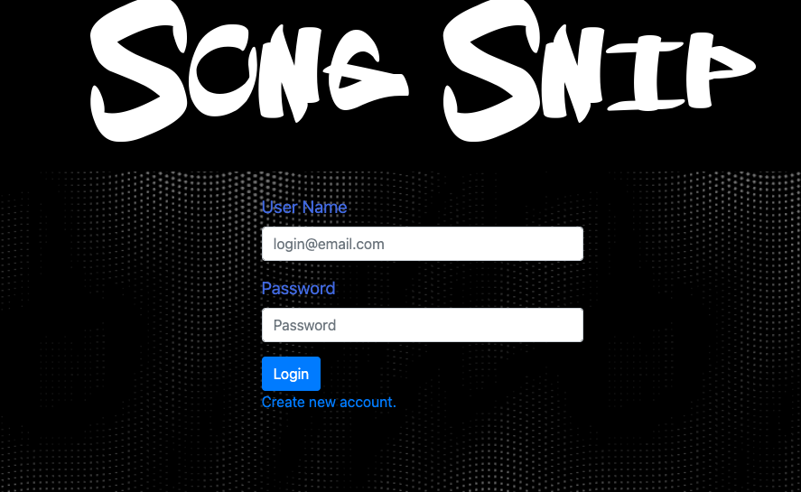

# Song Snip

  

  ## Description

  SongSnip is an application that allows users to listen to and save the best parts of their favorite songs.

  ## Table of Contents

  -[Installation](#installation)

  -[Usage](#Usage)

  -[License](#license)

  -[Contributing](#contributing)

  -[Tests](#tests)

  -[Questions](#questions)
  
  -[Demonstration](#demonstration)
  
  -[Credits](#credits)

  ## Installation

  npm install in both the client and outside the client.

  ## Usage

  Do not forget to npm install and npm run build in the client.

  ## License

  This project is licensed under [MIT](https://opensource.org/licenses/MIT) license.

  ## Contributing

  Be careful and create your own branch please.

  ## Tests

  TBD

  ## Questions

  If you have any questions about the repo, open an issue or contact us directly at egomezfax19@gmail.com, Chukwuanumba@gmail.com, abraham.glez09@gmail.com, or michael.shepard8@gmail.com.
  
  ## Demonstration
  [Click here](https://tranquil-ocean-58611.herokuapp.com/analyze) to be directed to the application.
  
  
   ## Credit
  
  - [Abraham Gonzalez](https://github.com/agonzalez57)
  
  - [Ralph Anumba](https://github.com/Ranumba89)
  
  - [Michael Shepard](https://github.com/mbshepard)
  
  - [Erik Gomez](https://github.com/egome019)

  
